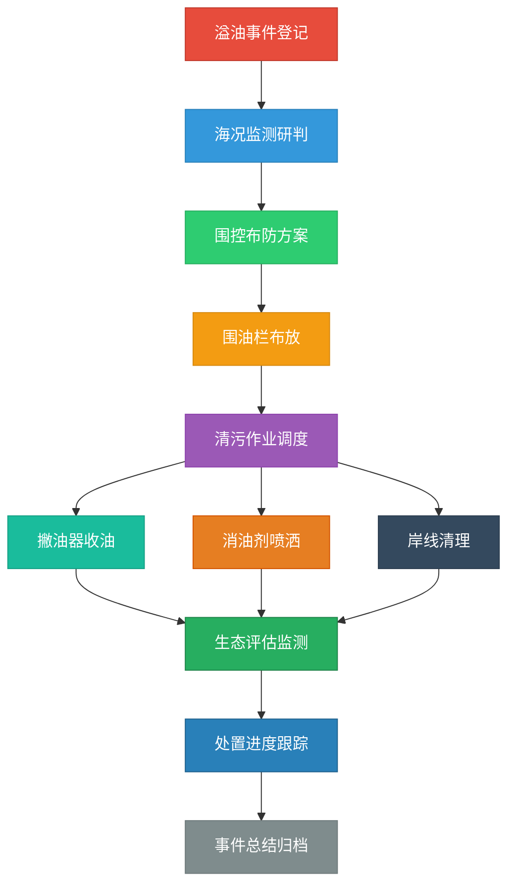

## 1. 产品概述
海上溢油应急处置客户端软件，面向海事应急管理部门，用于海上溢油事件的监测、围控和清污全流程管理。系统整合溢油事件登记、海况监测、围控布防、清污作业调度、生态评估等核心功能，实现应急处置的数字化、可视化和智能化管理。

## 2. 核心功能

### 2.1 用户角色
| 角色 | 注册方式 | 核心权限 |
|------|----------|----------|
| 应急指挥员 | 系统账号登录 | 事件管理、资源调度、全面监控 |
| 监测人员 | 系统账号登录 | 海况监测、数据录入、状态更新 |
| 作业人员 | 系统账号登录 | 作业执行、进度上报、设备管理 |

### 2.2 功能模块
1. **溢油事件模块**: 事件登记、事件列表、事件详情、事件总结
2. **海况监测模块**: 油膜扩散监测、海流风向研判、实时数据展示
3. **围控布防模块**: 围油栏布放、布防方案、状态监控
4. **清污作业模块**: 撇油器收油、消油剂喷洒、岸线清理、作业进度
5. **资源调度模块**: 清污船调度、设备管理、人员调配
6. **生态评估模块**: 敏感资源保护、生态损害评估
7. **处置统计模块**: 处置进度统计、事件总结报告、历史数据

### 2.3 页面详情
| 页面名称 | 模块名称 | 功能描述 |
|----------|----------|----------|
| 总览仪表板 | 系统总览 | 实时事件概览、关键指标卡片、快速操作入口 |
| 溢油事件登记 | 溢油事件 | 事件基本信息录入、位置标注、油种信息、溢油量估算 |
| 事件列表 | 溢油事件 | 事件列表展示、状态筛选、详情查看 |
| 油膜扩散监测 | 海况监测 | 油膜扩散可视化、动态模拟、影响范围预测 |
| 海流风向研判 | 海况监测 | 海流数据、风向风速、气象信息、扩散趋势分析 |
| 围油栏布放 | 围控布防 | 布放位置规划、设备状态、布放进度 |
| 撇油器收油 | 清污作业 | 作业设备管理、收油量统计、作业记录 |
| 消油剂喷洒 | 清污作业 | 喷洒区域规划、药剂用量、喷洒进度 |
| 清污船调度 | 资源调度 | 船舶列表、位置追踪、任务分配 |
| 岸线清理 | 清污作业 | 岸段划分、清理进度、垃圾处理 |
| 敏感资源保护 | 生态评估 | 敏感资源分布、保护措施、状态监控 |
| 生态损害评估 | 生态评估 | 损害范围、影响评估、恢复预测 |
| 处置进度 | 处置统计 | 进度可视化、里程碑管理、资源消耗统计 |
| 事件总结 | 处置统计 | 报告生成、经验总结、档案归档 |

## 3. 核心流程

## 4. 用户界面设计

### 4.1 设计风格
- **主色调**: 深海蓝 (#0A2463)，代表海事与专业
- **辅助色**: 警戒橙 (#FF6B35)，用于预警和紧急状态；海洋绿 (#3E92CC)，用于监测和正常状态
- **警示色**: 红色 (#E63946) 表示危险，黄色 (#F4D35E) 表示警告，绿色 (#06D6A0) 表示安全
- **按钮风格**: 圆角8px，带有微妙阴影，hover状态有轻微上浮效果
- **字体**: 标题使用 "Noto Sans SC" Bold，正文使用 "Noto Sans SC" Regular
- **布局风格**: 侧边导航 + 顶部状态栏 + 主内容区，卡片式布局，数据可视化图表
- **图标风格**: 使用 lucide-react 线性图标，保持统一的24px尺寸

### 4.2 页面设计概述
| 页面名称 | 模块名称 | UI元素 |
|----------|----------|--------|
| 总览仪表板 | 系统总览 | 大号数据卡片、事件列表、快速操作区、迷你地图 |
| 溢油事件登记 | 溢油事件 | 表单布局、位置选择器、油种选择下拉框、提交按钮组 |
| 油膜扩散监测 | 海况监测 | 全屏地图、油膜动画层、时间轴滑块、图例说明 |
| 海流风向研判 | 海况监测 | 风向风速仪表、海流流向图、数据趋势折线图 |
| 围油栏布放 | 围控布防 | 地图标注、设备状态卡片、进度条、操作按钮 |
| 清污作业 | 清污作业 | 作业设备卡片、作业进度环形图、数据表格 |
| 资源调度 | 资源调度 | 船舶列表卡片、位置追踪地图、任务分配弹窗 |
| 生态评估 | 生态评估 | 敏感资源分布图、损害评估雷达图、保护措施列表 |
| 处置统计 | 处置统计 | 进度甘特图、资源消耗柱状图、报告预览区 |

### 4.3 响应式设计
- 桌面优先设计，支持1920px及以上分辨率
- 平板端自适应：侧边栏可折叠，卡片网格调整为2列
- 移动端：侧边栏转为底部导航，单列布局，优化触控区域

### 4.4 视觉效果
- 地图背景使用深蓝色渐变，模拟海洋效果
- 油膜扩散使用半透明橙色渐变动画，表现漂浮感
- 数据更新时使用淡入过渡动画
- 关键指标数字使用计数动画效果
- 紧急事件使用脉冲动画提醒
