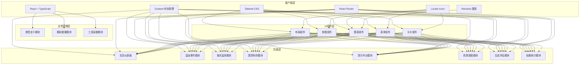
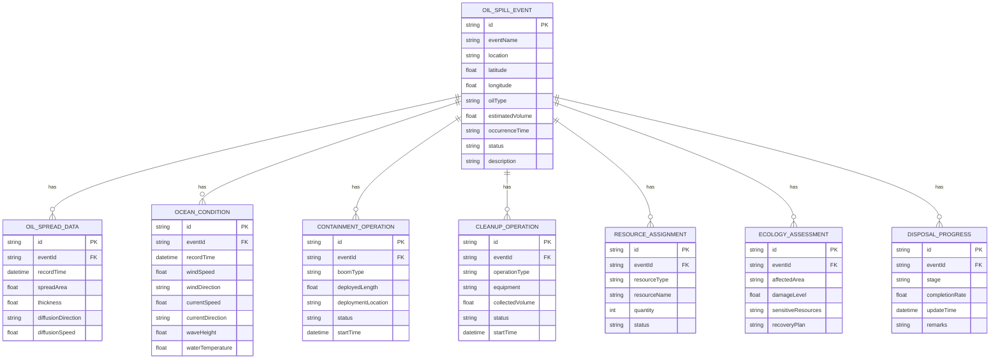

## 1. 架构设计



## 2. 技术描述
- **前端框架**: React@18 + TypeScript
- **构建工具**: Vite@5
- **样式方案**: Tailwind CSS@3
- **状态管理**: Zustand@4
- **路由管理**: React Router DOM@6
- **图标库**: Lucide React@0.400
- **图表库**: Recharts@2
- **地图可视化**: 使用 SVG + CSS 模拟（无真实地图依赖）

## 3. 路由定义
| 路由路径 | 页面组件 | 功能描述 |
|----------|----------|----------|
| `/` | Dashboard | 系统总览仪表板 |
| `/events` | EventList | 溢油事件列表 |
| `/events/register` | EventRegister | 溢油事件登记 |
| `/events/:id` | EventDetail | 事件详情 |
| `/monitoring/oil-spread` | OilSpreadMonitoring | 油膜扩散监测 |
| `/monitoring/ocean-condition` | OceanCondition | 海流风向研判 |
| `/containment/boom-deployment` | BoomDeployment | 围油栏布放 |
| `/cleanup/skimmer` | SkimmerOperation | 撇油器收油 |
| `/cleanup/dispersant` | DispersantSpray | 消油剂喷洒 |
| `/cleanup/shoreline` | ShorelineCleanup | 岸线清理 |
| `/resources/vessels` | VesselDispatch | 清污船调度 |
| `/ecology/sensitive-resources` | SensitiveResources | 敏感资源保护 |
| `/ecology/assessment` | EcologyAssessment | 生态损害评估 |
| `/statistics/progress` | DisposalProgress | 处置进度 |
| `/statistics/summary` | EventSummary | 事件总结 |

## 4. 数据模型

### 4.1 数据模型定义



### 4.2 类型定义

```typescript
// 事件状态
type EventStatus = 'pending' | 'monitoring' | 'containment' | 'cleanup' | 'completed' | 'archived';

// 溢油事件
interface OilSpillEvent {
  id: string;
  eventName: string;
  location: string;
  latitude: number;
  longitude: number;
  oilType: string;
  estimatedVolume: number;
  occurrenceTime: string;
  status: EventStatus;
  description: string;
}

// 油膜扩散数据
interface OilSpreadData {
  id: string;
  eventId: string;
  recordTime: string;
  spreadArea: number;
  thickness: number;
  diffusionDirection: string;
  diffusionSpeed: number;
}

// 海况数据
interface OceanCondition {
  id: string;
  eventId: string;
  recordTime: string;
  windSpeed: number;
  windDirection: string;
  currentSpeed: number;
  currentDirection: string;
  waveHeight: number;
  waterTemperature: number;
}

// 围控作业
interface ContainmentOperation {
  id: string;
  eventId: string;
  boomType: string;
  deployedLength: number;
  deploymentLocation: string;
  status: 'planning' | 'deploying' | 'deployed' | 'recovering';
  startTime: string;
}

// 清污作业
interface CleanupOperation {
  id: string;
  eventId: string;
  operationType: 'skimmer' | 'dispersant' | 'shoreline';
  equipment: string;
  collectedVolume: number;
  status: 'idle' | 'in_progress' | 'paused' | 'completed';
  startTime: string;
}

// 资源调度
interface ResourceAssignment {
  id: string;
  eventId: string;
  resourceType: 'vessel' | 'equipment' | 'personnel' | 'material';
  resourceName: string;
  quantity: number;
  status: 'available' | 'assigned' | 'in_use' | 'returned';
}

// 生态评估
interface EcologyAssessment {
  id: string;
  eventId: string;
  affectedArea: string;
  damageLevel: number;
  sensitiveResources: string[];
  recoveryPlan: string;
}

// 处置进度
interface DisposalProgress {
  id: string;
  eventId: string;
  stage: string;
  completionRate: number;
  updateTime: string;
  remarks: string;
}
```

## 5. 项目结构

```
src/
├── components/          # 公共组件
│   ├── Layout/         # 布局组件
│   ├── Map/            # 地图可视化组件
│   ├── Charts/         # 图表组件
│   ├── Cards/          # 卡片组件
│   └── Forms/          # 表单组件
├── pages/              # 页面组件
│   ├── Dashboard/
│   ├── Events/
│   ├── Monitoring/
│   ├── Containment/
│   ├── Cleanup/
│   ├── Resources/
│   ├── Ecology/
│   └── Statistics/
├── store/              # 状态管理
│   └── useStore.ts
├── types/              # 类型定义
│   └── index.ts
├── data/               # 模拟数据
│   └── mockData.ts
├── utils/              # 工具函数
│   └── helpers.ts
├── App.tsx
├── main.tsx
└── index.css
```

## 6. 前端质量标准

| 检查项 | 标准 |
|--------|------|
| 代码规范 | ESLint + Prettier |
| 类型安全 | 严格 TypeScript，no any |
| 组件规范 | 单文件 < 300 行，职责单一 |
| 性能优化 | 按需渲染，避免不必要重渲染 |
| 可访问性 | 语义化 HTML，ARIA 标签 |
| 视觉质量 | 响应式设计，动画流畅 |
